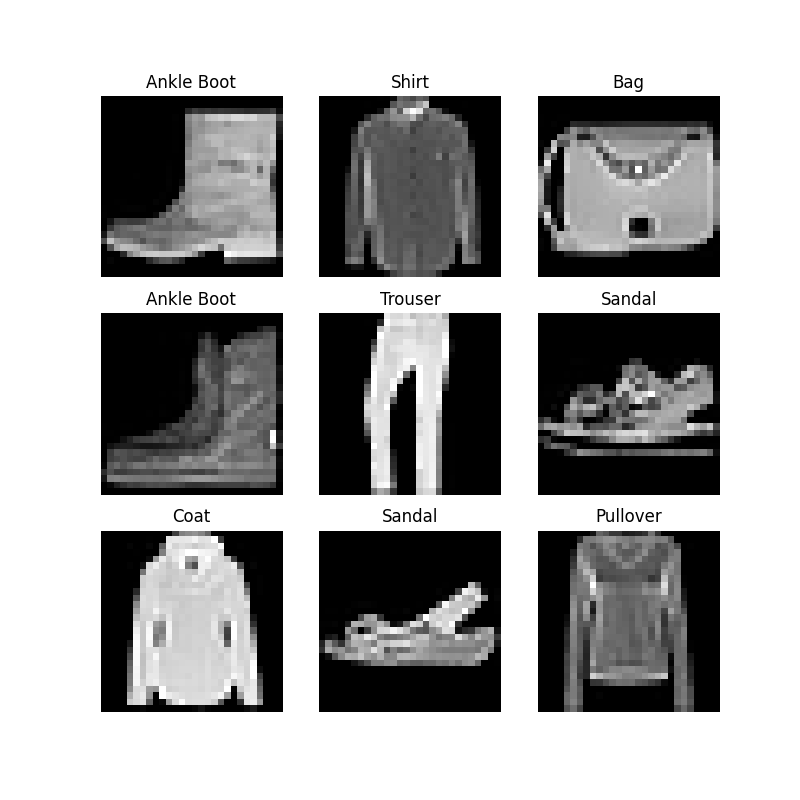
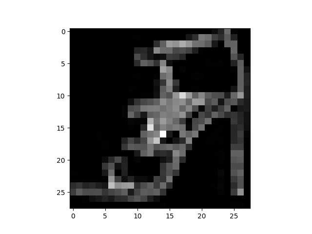

# 数据集和数据加载器

> 译者：[Daydaylight](https://github.com/Daydaylight)
>
> 项目地址：<https://pytorch.apachecn.org/2.0/tutorials/datasets_dataloaders>
>
> 原始地址：<https://pytorch.org/tutorials/beginner/basics/data_tutorial.html>

处理数据样本的代码可能会变得杂乱无章，难以维护；我们希望我们的数据集代码与我们的模型训练代码分段，以提高可读性和模块化。
PyTorch提供了两个数据基元： ``torch.utils.data.DataLoader``和``torch.utils.data.Dataset``。允许你使用预先加载的数据集以及你自己的数据。
``Dataset``存储样本和它们相应的标签，``DataLoader``在``Dataset``基础上添加了一个迭代器，迭代器可以迭代数据集，以便能够轻松地访问``Dataset``中的样本。

PyTorch领域库提供了一些预加载的数据集（如FashionMNIST），这些数据集是``torch.utils.data.Dataset``的子类，并实现特定数据的功能。它们可以被用来为你的模型制作原型和基准。你可以找到它们这里：[Image Datasets](https://pytorch.org/vision/stable/datasets.html)、[Text Datasets](https://pytorch.org/text/stable/datasets.html)，和[Audio Datasets](https://pytorch.org/audio/stable/datasets.html)

##加载一个数据集

下面是一个如何从TorchVision加载[Fashion-MNIST](https://research.zalando.com/project/fashion_mnist/fashion_mnist/)数据集的例子。
Fashion-MNIST是一个由60,000个训练实例和10,000个测试实例组成的Zalando的文章图像数据集。
每个例子包括一个28×28的灰度图像和10个类别中的一个相关标签。
我们加载 [FashionMNIST Dataset](https://pytorch.org/vision/stable/datasets.html#fashion-mnist) ，参数如下：
 - ``root`` 是存储训练/测试数据的路径,
 - ``train`` 指定训练或测试数据集,
 - ``download=True`` 如果``root``没有数据，就从网上下载数据。
 - ``transform`` 和 ``target_transform`` 指定特征和标签的转换。

```py
import torch
from torch.utils.data import Dataset
from torchvision import datasets
from torchvision.transforms import ToTensor
import matplotlib.pyplot as plt


training_data = datasets.FashionMNIST(
    root="data",
    train=True,
    download=True,
    transform=ToTensor()
)

test_data = datasets.FashionMNIST(
    root="data",
    train=False,
    download=True,
    transform=ToTensor()
)
```

## 迭代和可视化数据集

我们可以像列表一样手动索引``Datasets``：``training_data[index]``。
我们使用``matplotlib``来可视化我们训练数据中的一些样本。

```py
labels_map = {
    0: "T-Shirt",
    1: "Trouser",
    2: "Pullover",
    3: "Dress",
    4: "Coat",
    5: "Sandal",
    6: "Shirt",
    7: "Sneaker",
    8: "Bag",
    9: "Ankle Boot",
}
figure = plt.figure(figsize=(8, 8))
cols, rows = 3, 3
for i in range(1, cols * rows + 1):
    sample_idx = torch.randint(len(training_data), size=(1,)).item()
    img, label = training_data[sample_idx]
    figure.add_subplot(rows, cols, i)
    plt.title(labels_map[label])
    plt.axis("off")
    plt.imshow(img.squeeze(), cmap="gray")
plt.show()
```



## 为你的文件创建一个自定义数据集

一个自定义的数据集类必须实现三个函数： `__init__`, `__len__`, 和 `__getitem__`。
看看这个实现；FashionMNIST的图片被存储在一个`img_dir'`的目录中，而它们的标签则分别存储在一个CSV文件``annotations_file`中。

在接下来的章节中，我们将分解这些函数中的每一个发生了什么。

```py
import os
import pandas as pd
from torchvision.io import read_image

class CustomImageDataset(Dataset):
    def __init__(self, annotations_file, img_dir, transform=None, target_transform=None):
        self.img_labels = pd.read_csv(annotations_file)
        self.img_dir = img_dir
        self.transform = transform
        self.target_transform = target_transform

    def __len__(self):
        return len(self.img_labels)

    def __getitem__(self, idx):
        img_path = os.path.join(self.img_dir, self.img_labels.iloc[idx, 0])
        image = read_image(img_path)
        label = self.img_labels.iloc[idx, 1]
        if self.transform:
            image = self.transform(image)
        if self.target_transform:
            label = self.target_transform(label)
        return image, label
```

### __init__

在实例化数据集对象时，__init__函数被运行一次。我们初始化包含图像的目录、注释文件和两种转换（下一节将详细介绍）。

标签.csv文件看起来像：

```py
tshirt1.jpg, 0
tshirt2.jpg, 0
......
ankleboot999.jpg, 9

```

```py
def __init__(self, annotations_file, img_dir, transform=None, target_transform=None):
    self.img_labels = pd.read_csv(annotations_file)
    self.img_dir = img_dir
    self.transform = transform
    self.target_transform = target_transform
```

### __len__

函数__len__返回我们数据集中的样本数。

Example:

```py
def __len__(self):
    return len(self.img_labels)
```
### __getitem__

函数 __getitem__ 从数据集中给定的索引``idx``处加载并返回一个样本。根据索引，它确定图像在磁盘上的位置，用``read_image``将其转换为张量，从``self.img_labels``的csv数据中获取相应的标签。从``self.img_labels``中的csv数据中获取相应的标签，对它们调用transform函数（如果适用），并返回张量图像和相应的标签的元组。

```py
def __getitem__(self, idx):
    img_path = os.path.join(self.img_dir, self.img_labels.iloc[idx, 0])
    image = read_image(img_path)
    label = self.img_labels.iloc[idx, 1]
    if self.transform:
        image = self.transform(image)
    if self.target_transform:
        label = self.target_transform(label)
    return image, label
```

## 用DataLoaders准备你的数据进行训练

 ``Dataset``每次检索一个我们数据集的特征和标签样本。在训练一个模型时，我们通常希望以 "小批量 "的方式传递样本，在每个周期重新洗牌数据以减少模型的过拟合，并使用Python的``multiprocessing``来加快数据的检索速度。
 
`DataLoader'是一个可迭代的，它用一个简单的API为我们抽象出这种复杂性。

```py
from torch.utils.data import DataLoader

train_dataloader = DataLoader(training_data, batch_size=64, shuffle=True)
test_dataloader = DataLoader(test_data, batch_size=64, shuffle=True)
```

## 遍历DataLoader

我们已经将该数据集加载到``DataLoader``中，并可以根据需要迭代该数据集。下面的每次迭代都会返回一批``train_features``和``train_labels``（分别包含``batch_size=64``的特征和标签）。因为我们指定了``shuffle=True``，在我们遍历所有批次后，数据会被洗牌（为了更精细地控制数据加载顺序的精细控制，请看[Samplers](https://pytorch.org/docs/stable/data.html#data-loading-order-and-sampler)）。

```py
# 显示图像和标签。
train_features, train_labels = next(iter(train_dataloader))
print(f"Feature batch shape: {train_features.size()}")
print(f"Labels batch shape: {train_labels.size()}")
img = train_features[0].squeeze()
label = train_labels[0]
plt.imshow(img, cmap="gray")
plt.show()
print(f"Label: {label}")
```

输出：



```py
Feature batch shape: torch.Size([64, 1, 28, 28])
Labels batch shape: torch.Size([64])
Label: 5
```

## 阅读更多
- [torch.utils.data API](https://pytorch.org/docs/stable/data.html)
