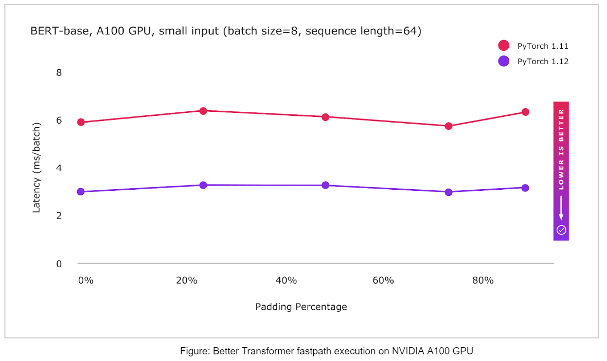

# 新版本: PyTorch 1.12：TorchArrow，模块和nvFuser的功能API，现已可用

> 发布: 2022年06月28日
> 
> 译者：[@片刻](https://github.com/jiangzhonglian)
> 
> 原文: <https://pytorch.org/blog/pytorch-1.12-released/>
> 
> 翻译: <https://pytorch.apachecn.org/LatestChanges/PyTorch_V1.12>

**来自 PyTorch团队**

我们很高兴地宣布PyTorch 1.12（[发布说明](https://github.com/pytorch/pytorch/releases/tag/v1.12.0)）的发布！此版本由超过3124个提交，433个贡献者组成。除了1.12，我们正在发布AWS S3集成的测试版，CPU上最后一个通道上的PyTorch Vision模型，使用Bfloat16和FSDP API在英特尔®至强®可扩展处理器上授权PyTorch。我们衷心感谢我们敬业的社区的贡献。

总结：

*   功能API在功能上应用给定参数集的模块计算
*   PyTorch中的复杂32和复杂卷积
*   来自TorchData的DataPipes与DataLoader完全向后兼容
*   改进了API覆盖范围的函数
*   nvFuser是PyTorch的深度学习编译器
*   Ampere及更高版本的CUDA硬件上的float32矩阵乘法精度的更改
*   TorchArrow，一个新的测试版库，用于对批处理数据的机器学习预处理

## 前端API

### 介绍 TorchArrow

我们准备了一个新的测试版，供您尝试使用：TorchArrow。这是一个用于对批处理数据进行机器学习预处理的库。它具有高性能和熊猫风格、易于使用的API，以加快您的预处理工作流程和开发。

目前，它提供了一个具有以下功能的Python DataFrame接口：

*   高性能CPU后端，矢量化和可扩展的用户定义函数（UDF）与[Velox](https://github.com/facebookincubator/velox)
*   使用PyTorch或其他模型创作进行无缝切换，例如张量整理，并轻松插入PyTorch DataLoader和DataPipes
*   通过箭头内存列格式为外部阅读器提供零副本

有关更多详细信息，请参阅我们的[10分钟教程](https://github.com/pytorch/torcharrow/blob/main/tutorial/tutorial.ipynb)、[安装说明](https://github.com/pytorch/torcharrow#installation)、[API文档](https://pytorch.org/torcharrow/beta/)和TorchRec中数据预处理的[原型](https://github.com/pytorch/torchrec/tree/main/examples/torcharrow)。

### （Beta）模块的功能API

PyTorch 1.12引入了一个新的测试版功能，用于在功能上应用给定参数集的模块计算。有时，在内部维护静态参数集的传统PyTorch模块使用模式限制性太强。在实现元学习算法时，通常会出现这种情况，其中可能需要跨优化器步骤维护多组参数。

The new `torch.nn.utils.stateless.functional_call()` API allows for:

*   模块计算对所使用的一组参数具有完全的灵活性
*   无需以功能性方式重新实施模块
*   模块中存在的任何参数或缓冲区都可以与外部定义的值交换，以用于调用。引用参数/缓冲区的命名遵循模块中的完全限定形式`state_dict()`

示例：

```
import torch
from torch import nn
from torch.nn.utils.stateless import functional_call

class MyModule(nn.Module):
    def __init__(self):
        super().__init__()
        self.fc1 = nn.Linear(3, 3)
        self.bn = nn.BatchNorm1d(3)
        self.fc2 = nn.Linear(3, 3)

    def forward(self, x):
        return self.fc2(self.bn(self.fc1(x)))

m = MyModule()

# Define parameter / buffer values to use during module computation.
my_weight = torch.randn(3, 3, requires_grad=True)
my_bias = torch.tensor([1., 2., 3.], requires_grad=True)
params_and_buffers = {
    'fc1.weight': my_weight,
    'fc1.bias': my_bias,
    # Custom buffer values can be used too.
    'bn.running_mean': torch.randn(3),
}

# Apply module computation to the input with the specified parameters / buffers.
inp = torch.randn(5, 3)
output = functional_call(m, params_and_buffers, inp)
```

### （Beta）PyTorch中的Complex32和Complex Convolutions

今天，PyTorch原生支持复数、复自动变、复模块和许多复杂运算，包括线性代数和快速傅里叶变换（FFT）运算符。许多库，包括torchaudio和ESPNet，已经在PyTorch中使用了复数，PyTorch 1.12通过复杂的卷积和实验性复杂32（“复杂半”）数据类型进一步扩展了复杂的功能，该数据类型可以实现半精度的FFT操作。由于CUDA 11.3软件包中的错误，如果您使用复数，我们建议您使用来自车轮的CUDA 11.6软件包。

### （Beta）正向模式自动区分

正向模式AD允许在正向传递中急切地计算定向导数（或等效的雅可比向量积）。PyTorch 1.12显著提高了前向模式AD的操作员覆盖率。有关更多信息，请参阅我们的[教程](https://pytorch.org/tutorials/search.html?q=forward-mode+automatic+differentiation+%28beta%29&check_keywords=yes&area=default#)。

### TorchData

#### BC DataLoader + DataPipe

在多处理和分布式环境中的洗牌确定性和动态分片方面，来自TorchDataData的“DataPipe”与现有的“DataLoader”完全向后兼容。有关更多详细信息，请查看[教程](https://pytorch.org/data/0.4.0/tutorial.html#working-with-dataloader)。

#### （Beta）AWS S3集成

基于[AWSSDK](https://github.com/aws/aws-sdk-cpp)的DataPipes已集成到TorchData中。它提供了由原生AWSSDK支持的以下功能：

*   根据前缀从每个S3存储桶中检索网址列表
    *   支持超时，以防止无限期挂起
    *   支持指定S3存储桶区域
*   从S3网址加载数据
    *   支持缓冲和多部分下载
    *   支持指定S3存储桶区域

AWS原生DataPipes仍处于测试阶段。而且，我们将继续调整它们，以提高他们的性能。

#### （Prototype）DataLoader2

DataLoader2在原型模式下可用。我们正在引入DataPipes、DataLoading API和后端（又名ReadingServices）之间交互的新方法。功能在API方面是稳定的，但功能尚未完成。我们欢迎早期采用者和反馈，以及潜在的贡献者。

有关更多详细信息，请查看[链接](https://github.com/pytorch/data/tree/main/torchdata/dataloader2)。

### 功能

受[Google JAX](https://github.com/google/jax)的启发，functorch是一个提供可组合vmap（矢量化）和自动差异转换的库。它启用了高级自动差异用例，否则在PyTorch中表达起来会很棘手。这些例子包括：

*   [在一台机器上运行模型合奏](https://pytorch.org/functorch/stable/notebooks/ensembling.html)
*   [高效计算雅可比人和黑斯人](https://pytorch.org/functorch/stable/notebooks/jacobians_hessians.html)
*   [计算每个样本梯度（或其他每个样本的数量）](https://pytorch.org/functorch/stable/notebooks/per_sample_grads.html)

我们很高兴地宣布functorch 0.2.0具有许多改进和新的实验功能。

#### 覆盖范围显著提高

我们显著改善了`functorch.jvp`（我们的前向模式自动扩散API）和其他依赖它的API（`functorch.{jacfwd, hessian}`）的覆盖率。

#### （Prototype）functorch.experimental.functionalize

给定一个函数f，`functionalize(f)`返回一个没有突变的新函数（有注意事项）。这对于在没有就地操作的情况下构建PyTorch函数的痕迹非常有用。例如，您可以使用`make_fx(functionalize(f))`来构造pytorch函数的无突变痕迹。要了解更多信息，请参阅[文档](https://pytorch.org/functorch/stable/generated/functorch.experimental.functionalize.html#functorch.experimental.functionalize)。

有关更多详细信息，请参阅我们的[安装说明](https://pytorch.org/functorch/stable/install.html)、[文档](https://pytorch.org/functorch/)、[教程](https://pytorch.org/functorch)和[发布说明](https://github.com/pytorch/functorch/releases)。

## 性能改进

### 介绍nvFuser，PyTorch的深度学习编译器

在PyTorch 1.12中，Torchscript正在将其默认融合器（用于Volta和后来的CUDA加速器）更新为nvFuser，它支持更广泛的操作范围，并且比CUDA设备以前的融合器NNC更快。即将发表的一篇博客文章将详细阐述nvFuser，并展示它如何加快在各种网络上的训练。

有关使用和调试的更多详细信息，请参阅[nvFuser文档](https://github.com/pytorch/pytorch/blob/release/1.12/torch/csrc/jit/codegen/cuda/README.md)。

### Ampere及更高版本的CUDA硬件上的float32矩阵乘法精度的更改

PyTorch支持各种“混合精度”技术，如torch.amp（自动混合精度）模块，并在Ampere和后来的CUDA硬件上使用TensorFloat32数据类型执行float32矩阵乘法，以更快地进行内部计算。在PyTorch 1.12中，我们正在更改float32矩阵乘法的默认行为，以始终使用完整的IEEE fp32精度，这比使用TensorFloat32数据类型进行内部计算更精确，但更慢。对于TensorFloat32与float32吞吐量比率特别高的设备，如A100，默认值的这种变化可能导致大幅放缓。

如果您一直在使用TensorFloat32矩阵乘法，那么您可以通过设置继续这样做`torch.backends.cuda.matmul.allow_tf32 = True`

这是自PyTorch 1.7以来支持的。从PyTorch 1.12开始，也可以使用新的matmul精度API：`torch.set_float32_matmul_precision(“highest”|”high”|”medium”)`

重申一下，PyTorch的新默认值是所有设备类型的“最高”精度。我们认为这为矩阵乘法提供了更好的设备类型一致性。新的精密API的文档可以[在这里](https://pytorch.org/docs/master/generated/torch.set_float32_matmul_precision.html?highlight=precision#torch.set_float32_matmul_precision)找到。设置“高”或“中”精度类型将在安培和之后的CUDA设备上启用TensorFloat32。如果您要更新到PyTorch 1.12，那么为了保持安培设备上矩阵乘法的当前行为和更快的性能，请将精度设置为“高”。

使用混合精度技术对于高效训练许多现代深度学习网络至关重要，如果您已经在使用torch.amp，此更改不太可能影响您。如果您不熟悉混合精度训练，请查看我们即将发布的“每个用户都应该知道的关于PyTorch混合精度训练的信息”博客文章。

### （Beta）在CPU上持续使用通道加速PyTorch Vision模型

在运行视觉模型时，内存格式对性能有重大影响，一般来说，由于数据位置更好，从性能的角度来看，通道最后更有利。1.12包括内存格式的基本概念，并在英特尔®至强®可扩展处理器上流行的PyTorch视觉模型上演示了使用Channels Last的性能优势。

*   为CPU上CV域中常用的运算符启用通道最后内存格式支持，适用于推理和训练
*   在ATen的通道最后一个内核上提供本机级优化，适用于AVX2和AVX512
*   在英特尔®至强®冰湖（或更新版本）CPU上为TorchVision型号的Channels First提供1.3倍至1.8倍的推理性能增益

### （Beta）使用Bfloat16在英特尔®至强®可扩展处理器上授权PyTorch

像bfloat16这样的精确数字格式降低了PyTorch在多个深度学习训练工作负载中的性能。PyTorch 1.12包括bfloat16上的最新软件增强功能，适用于更广泛的用户场景，并展示了更高的性能提升。主要改进包括：

*   在英特尔®至强®库珀湖CPU上引入的新bfloat16本机指令VDPBF16PS与float32相比，2倍硬件计算吞吐量与float32相比
*   float32的1/2内存占用空间，内存带宽密集型运营商的速度更快
*   英特尔®至强®库珀湖（或更新机型）CPU上的TorchVision型号的推断性能比float32高1.4倍至2.2倍

### （Prototype）在Mac上引入加速PyTorch训练

随着PyTorch 1.12的发布，开发人员和研究人员现在可以利用苹果硅GPU进行显著更快的模型训练。这解锁了直接在Mac上执行原型和本地微调等机器学习工作流程的能力。使用苹果的金属性能着色器（MPS）作为后端启用加速GPU训练。好处包括通过加速GPU训练提高性能，以及在本地训练大型网络或批量规模的能力。[在这里](https://pytorch.org/blog/introducing-accelerated-pytorch-training-on-mac/)了解更多。


仅CPU加速GPU训练和评估加速（速度更快）

除了新的MPS设备支持外，最近几个版本中可用的核心和域库的M1二进制文件现在是一个官方的原型功能。这些二进制文件可用于在苹果硅上原生运行PyTorch。

### （Prototype）BetterTransformer：变压器编码器推理的快速路径执行

PyTorch现在支持几个Transformer Encoder模块的CPU和GPU快速路径实现（“BetterTransformer”），包括TransformerEncoder、TransformerEncoderLayer和MultiHeadAttention（MHA）。BetterTransformer快速路径架构Better Transformer始终保持速度更快——在许多常见执行场景中，根据模型和输入特性，是2倍。新的启用BetterTransformer的模块与以前版本的PyTorch Transformer API兼容，如果现有模型满足快速路径执行要求，并将加速现有模型，以及使用以前版本的PyTorch训练的读取模型。PyTorch 1.12包括：

*   Torchtext预训练的RoBERTa和XLM-R模型的BetterTransformer集成
*   建立在PyTorch Transformer API上的Torchtext
*   快速路径执行通过融合内核将多个运算符合并到单个内核中来减少执行开销，从而提高性能
*   通过在自然语言处理中处理填充令牌期间利用数据稀疏性来实现额外加速的选项（通过在创建TransformerEncoder时设置enable_nested_tensor=True）
*   帮助用户了解为什么没有发生快速路径执行的诊断



## 分发

### （Beta）完全碎片数据并行（FSDP）API

[FSDP API](https://pytorch.org/blog/introducing-pytorch-fully-sharded-data-parallel-api/)通过跨数据并行工作者分片模型的参数、梯度和优化器状态，帮助轻松扩展大型模型训练，同时保持数据并行性的简单性。原型版本在PyTorch 1.11中发布，具有最低限度的功能集，有助于[扩展具有高达1T参数的模型测试](https://medium.com/pytorch/training-a-1-trillion-parameter-model-with-pytorch-fully-sharded-data-parallel-on-aws-3ac13aa96cff)。

在这个测试版中，FSDP API添加了以下功能来支持各种生产工作负载。此测试版中新添加的功能亮点包括：

1.  通用分片策略API-用户可以通过单行更改轻松在分片策略之间进行更改，从而比较和使用DDP（仅数据分片）、FSDP（完整模型和数据分片）或Zero2（仅分片优化器和梯度）来优化内存和性能，以满足其特定的训练需求
2.  细粒度混合精度策略-用户可以通过混合精度策略为模型参数、梯度通信和缓冲区指定半数据类型和完整数据类型（bfloat16、fp16或fp32）的混合。模型自动保存在fp32中，以实现最大的便携性
3.  变压器自动包装策略-通过注册模型层类，允许对基于变压器的模型进行最佳包装，从而加快训练性能
4.  使用 device_id init 进行更快的模型初始化 - 以流方式执行初始化，以避免 OOM 问题，并优化 init 与 CPU init 的性能
5.  Rank0流式传输，用于保存较大模型的完整模型-完全分片的模型可以通过所有GPU流式传输其碎片到排名0的GPU来保存，并且模型在排名0的CPU上以完整状态构建以保存

有关更多详细信息和示例代码，请查看[文档](https://pytorch.org/docs/1.11/fsdp.html?highlight=fsdp#module-torch.distributed.fsdp)和[教程](https://pytorch.org/tutorials/intermediate/FSDP_tutorial.html)。

感谢您的阅读，如果您对这些更新感兴趣，并想加入PyTorch社区，我们鼓励您加入[讨论论坛](https://discuss.pytorch.org/)并[打开GitHub问题](https://github.com/pytorch/pytorch/issues)。要从PyTorch获取最新消息，请在[Twitter](https://twitter.com/PyTorch)、[Medium](https://medium.com/pytorch)、[YouTube](https://www.youtube.com/pytorch)和[LinkedIn](https://www.linkedin.com/company/pytorch)上关注我们。

Cheers!

PyTorch 团队